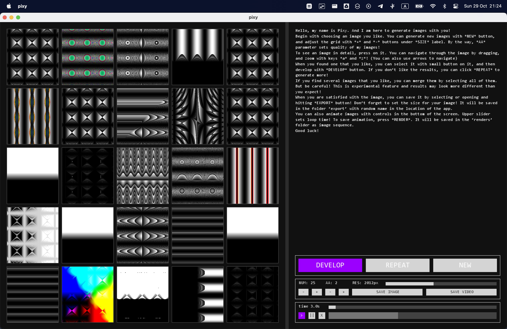

# Pixy

Evolutionary shaders in Processing from 2017.

Pixy is an application which uses a genetic algorithm to generate imagery and animation under the guidance of a user.

[Gallery on Behance](https://www.behance.net/gallery/69729037/Pixy)

## How it works

Pixy renders visuals based on mathematical equations with variables for the x and y locations of a pixel. Equations are generated via a node system, where each node represents a simple mathematical expression (`sin`, `mult`, `mix`, `fract`, logic ops, HSB/RGB conversions, …). Each equation is compiled into GLSL code and injected into a fragment shader, so every image is rendered entirely on the GPU.

In the beginning of the generative process, nodes are constructed randomly for each sample image. The user then chooses samples, whose nodes mutate and merge, producing new images. The process is repeated until appealing results are discovered:

- **New** — generates a grid of random samples.
- **Develop** — breeds the next generation from your selected image(s) by mutating nodes and, when several images are selected, merging them (swapping random branches between their node trees).
- **Repeat** — re-rolls the current generation if you don't like the offspring.

Images can be zoomed and panned, animated over a loop, and exported as high-resolution stills (`export/`) or animation frame sequences (`renders/`).

## Running

Open the sketch in [Processing](https://processing.org/) (written for Processing 3) and run `pixy.pde`. Requires the ControlP5 library.

## Files

- `pixy.pde` — entry point, window setup
- `app.pde` — UI and application state
- `dna.pde` — DNA: gene tree, mutation, crossover, GLSL code generation
- `genes.pde` — the gene pool: available operations and their probabilities
- `pop.pde` — population of artworks
- `artwork.pde` — a single image: shader compilation and rendering
- `nodedisplay.pde` — gene tree visualization
